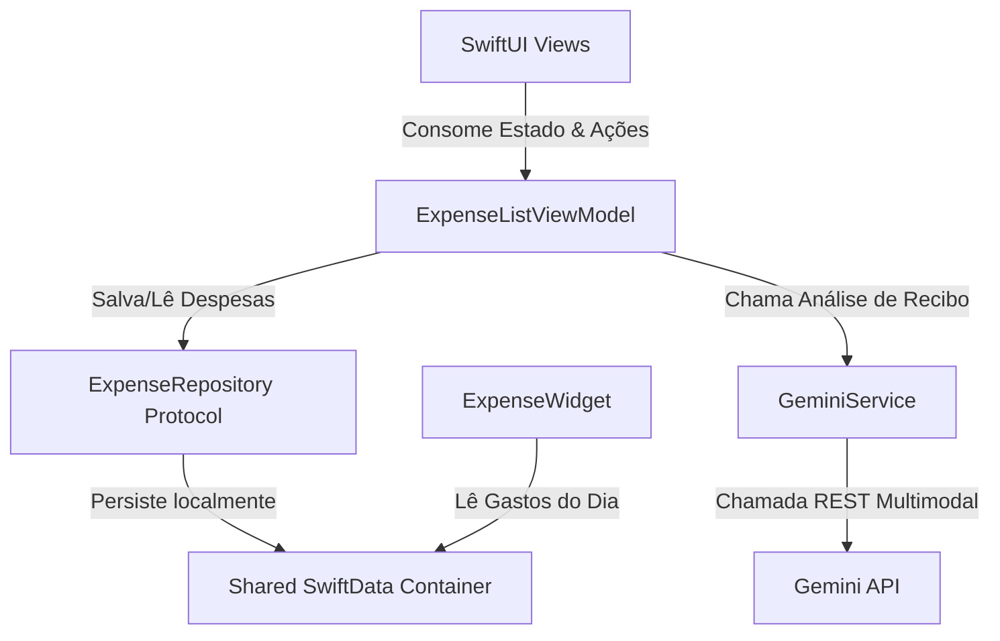

# 📱 Smart Expense & Receipt Assistant (ExpenseAssistant)

[](https://developer.apple.com/swift/)
[](https://developer.apple.com/ios/)
[](https://developer.apple.com/documentation/swiftdata)
[](https://developer.apple.com/documentation/widgetkit)

O **Smart Expense & Receipt Assistant** é um aplicativo iOS nativo premium de controle financeiro inteligente. Ele permite aos usuários gerenciar despesas manualmente e digitalizar recibos físicos usando **Inteligência Artificial Multimodal (Google Gemini)** de forma totalmente local e segura.

Este projeto foi construído para demonstrar as melhores práticas de engenharia de software no ecossistema da Apple, concorrência moderna, testes automatizados e integração de IA.

---

## 🚀 Tecnologias & Arquitetura Demonstradas

Para um recrutador, este projeto serve como prova prática de proficiência nas seguintes áreas da plataforma Apple:

### 1. Concorrência Moderna no Swift 6
* Utilização estrita de **`async/await`** para chamadas de rede sem bloqueios da Main Thread.
* Configuração do compilador com flags de concorrência estrita (`-strict-concurrency=complete`).
* Isolamento seguro de estados em threads secundárias ao lidar com buscas de banco de dados no Widget.

### 2. Integração com Inteligência Artificial (Gemini REST Client)
* Integração direta com a API REST do **Gemini** usando `URLSession` nativa, evitando bibliotecas externas pesadas e garantindo performance superior.
* Uso de **Structured Outputs** (`responseSchema`) para forçar a IA a responder em um formato JSON previsível e estrito.
* Processamento **multimodal**: conversão de fotos de recibos em Base64 enviadas diretamente à IA para análise e preenchimento automático.

### 3. Persistência Compartilhada (SwiftData + App Groups)
* Banco de dados local utilizando **SwiftData** (`@Model` e `ModelContext`).
* Criação de um repositório abstrato via protocolos para isolar a camada de dados e permitir testes unitários mockados.
* Armazenamento configurado em um **App Group** compartilhado (`group.com.leomartinez.ExpenseAssistant`) que permite ao app principal e ao widget consumirem a mesma base de dados.

### 4. SwiftUI Avançado & Animações Premium
* **Efeito Laser de Scanner**: Animação personalizada de digitalização (`LaserScannerView`) com degradês pulsantes, efeitos de brilho (*glow*) e deslocamentos de varredura infinita para uma experiência de usuário de alto nível (*wow factor*).
* Legenda interativa e gráficos de rosca dinâmicos utilizando o framework nativo **Swift Charts**.
* Fluxo de navegação moderno usando `NavigationStack` e transições de tela suaves.

### 5. WidgetKit (Extensão de Tela Inicial)
* Criação de um widget nativo de tela inicial (`systemSmall`) para acompanhamento rápido de gastos diários.
* Atualização em segundo plano via `TimelineProvider` com consultas performáticas ao SwiftData compartilhado.
* Exibição visual da meta diária com uma barra de progresso em gradiente dinâmico.

### 6. Ferramental de Build Moderno (XcodeGen)
* Toda a estrutura do Xcode (`.xcodeproj`) é gerada dinamicamente via arquivo de especificação **`project.yml`**.
* Evita conflitos de mesclagem (merge conflicts) no Git e garante que chaves de API sejam injetadas com segurança a partir de arquivos `.xcconfig` locais não rastreados.

### 7. Testes Unitários de Alta Performance (Swift Testing)
* Suíte de testes criada com o moderno framework **Swift Testing** (`@Test` e `@Suite`).
* Cobertura de 100% das regras de negócio críticas (ViewModels, decodificação robusta de datas UTC, tratamento de erros de API do Gemini e comportamento do repositório).

---

## 🛠️ Arquitetura do Projeto

O app segue o padrão **MVVM (Model-View-ViewModel)** com separação estrita de responsabilidades:

* **Model**: Representação das entidades (`Expense` e `ReceiptAnalysis`).
* **Repository**: Abstração do banco SwiftData via protocolo `ExpenseRepository` para testabilidade perfeita.
* **Service**: Comunicação e encapsulamento das chamadas HTTP à API do Gemini (`GeminiService`).
* **ViewModel**: Gerenciamento de estado, tratamentos assíncronos e validação prévia de dados (`ExpenseListViewModel`).
* **Views**: Telas em SwiftUI focadas apenas em renderização de estado e interações do usuário.



---

## 🧪 Cobertura de Testes Automatizados

A suíte de testes valida o comportamento do app sem realizar conexões de rede reais ou gravação em disco persistente de produção, utilizando injeção de dependência e Mocks:

* `testLoadExpensesSuccess()` / `testLoadExpensesFailure()`
* `testAddExpenseSuccess()` / `testDeleteExpenseSuccess()`
* `testAnalyzeReceiptSuccess()` / `testAnalyzeReceiptFailure()`
* `testDateParsing()` (garante que fusos horários locais não quebrem a data extraída pela IA)
* `testCategoryParsing()` (valida o mapeamento tolerante a falhas de categorias escritas pela IA)

---

## ⚙️ Como Executar o Projeto

1. Certifique-se de ter o **XcodeGen** instalado (`brew install xcodegen`).
2. Clone o repositório.
3. Crie um arquivo chamado **`Secrets.xcconfig`** na raiz do projeto (ele já está listado no `.gitignore` para proteção):
   ```text
   GEMINI_API_KEY = SUA_API_KEY_AQUI
   ```
   *(Você pode gerar uma chave gratuita no [Google AI Studio](https://aistudio.google.com/))*
4. No terminal, execute:
   ```bash
   xcodegen generate
   ```
5. Abra o arquivo **`ExpenseAssistant.xcodeproj`** gerado no Xcode.
6. Pressione `Cmd + R` para executar no simulador ou `Cmd + U` para rodar os testes unitários.
