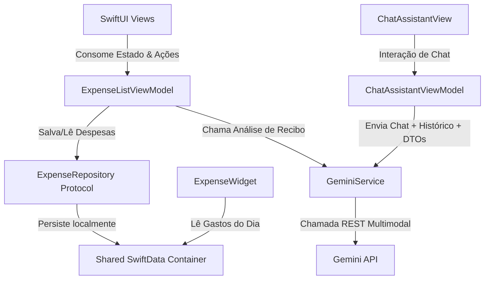

# 📱 Smart Expense & Receipt Assistant (ExpenseAssistant)

[](https://developer.apple.com/swift/)
[](https://developer.apple.com/ios/)
[](https://developer.apple.com/documentation/swiftdata)
[](https://developer.apple.com/documentation/widgetkit)
[](#)
[](#)
[](#)
[](#)

O **Smart Expense & Receipt Assistant** é um aplicativo iOS nativo premium de controle financeiro inteligente. Ele permite aos usuários gerenciar despesas manualmente, digitalizar recibos físicos usando **Inteligência Artificial Multimodal (Google Gemini)** e obter orientações financeiras personalizadas através de um **Chat Assistente (IA Coach)** de forma local, rápida e segura.

Este projeto foi construído para servir como **portfólio técnico de nível sênior**, demonstrando as melhores práticas de engenharia de software no ecossistema da Apple, concorrência moderna, testes automatizados e integração prática de IA.

---

## 🚀 Tecnologias & Arquitetura Demonstradas

Para um recrutador, este projeto serve como prova prática de proficiência nas seguintes áreas da plataforma Apple:

### 1. Concorrência Moderna & Segurança de Dados (Swift 6)
* Utilização estrita de **`async/await`** para chamadas de rede sem bloqueios da Main Thread.
* Configuração do compilador com flags de concorrência estrita (`-strict-concurrency=complete`).
* **Resolução de Data Race**: Mapeamento seguro de modelos do SwiftData (`Expense` - que por ser uma classe gerenciada de banco não é thread-safe) em estruturas de transferência de dados imutáveis e em conformidade com **`Sendable`** (`ExpenseDTO`) antes de cruzar as fronteiras assíncronas de isolamento de atores.
* Isolamento seguro de estados em threads secundárias ao lidar com buscas de banco de dados na timeline do Widget.

### 2. Integração Conversacional com Inteligência Artificial
* Integração direta com a API REST do **Gemini** usando `URLSession` nativa, evitando bibliotecas externas pesadas e garantindo performance superior.
* **[Novo] Chat IA Coach**: Canal conversacional interativo onde o usuário envia perguntas e a IA atua como assistente pessoal de gastos. O histórico de mensagens e os gastos reais da base de dados do usuário são formatados e injetados de forma dinâmica no contexto do modelo para gerar respostas analíticas e sugestões de economia exatas.
* **Structured Outputs** (`responseSchema`): Uso da funcionalidade nativa do Gemini para obter respostas estruturadas em JSON estrito durante a digitalização de notas.
* **Multimodalidade**: Transmissão de imagens de recibos convertidas em Base64 diretamente nas payloads das chamadas.

### 3. Persistência Compartilhada (SwiftData + App Groups)
* Banco de dados local utilizando **SwiftData** (`@Model` e `ModelContext`).
* Criação de um repositório abstrato via protocolos para isolar a camada de dados e permitir testes unitários mockados.
* Armazenamento configurado em um **App Group** compartilhado (`group.com.leomartinez.ExpenseAssistant`) que permite ao app principal e ao widget consumirem a mesma base de dados.

### 4. SwiftUI Avançado & Interatividade no Dashboard
* **Efeito Laser de Scanner**: Animação personalizada de digitalização (`LaserScannerView`) com degradês pulsantes, efeitos de brilho (*glow*) e deslocamentos de varredura infinita para uma experiência de usuário de alto nível (*wow factor*).
* **[Novo] Efeito Liquid Glass**: Fundo dinâmico (`LiquidGlassBackgroundView`) com gradientes fluidos e orgânicos que se movem de forma animada por trás de uma camada translúcida (`.ultraThinMaterial`) com bordas especulares no Chat com IA.
* **[Novo] Toolbar de Filtros Flutuante**: O menu de períodos do Dashboard foi remodelado como uma cápsula flutuante de vidro líquido com desfoque de fundo reativo à rolagem de transações.
* **[Novo] Transições de Zoom (iOS 18)**: Navegação elástica nativa de Zoom para transição do Dashboard ao Chat com IA, implementada com fallback seguro para iOS 17.
* **[Novo] Integração Háptica (Haptic Feedback)**: Sincronização de toques táteis físicos (`UISelectionFeedbackGenerator` e `UINotificationFeedbackGenerator`) integrados no ritmo do laser de digitalização e nas notificações de sucesso/erro da IA.
* **Gráficos Dinâmicos e Interatividade**: Utilização do **Swift Charts** com legenda clicável que permite ao usuário tocar em uma categoria específica e destacar/filtrar a lista de transações recentes associadas em tempo real.

### 5. WidgetKit (Extensão de Tela Inicial)
* Criação de um widget nativo de tela inicial (`systemSmall`) para acompanhamento rápido de gastos diários.
* Consulta ao SwiftData compartilhado em threads de segundo plano no `TimelineProvider`.
* Barra de progresso visual mostrando a porcentagem da meta de limite diário (R$ 150) com gradiente dinâmico.

### 6. Ferramental de Build Moderno (XcodeGen)
* Toda a estrutura do Xcode (`.xcodeproj`) é gerada dinamicamente via arquivo de especificação **`project.yml`**.
* Evita conflitos de mesclagem (merge conflicts) no Git e garante que chaves de API sejam injetadas com segurança a partir de arquivos `.xcconfig` locais não rastreados.

### 7. Testes Unitários de Alta Performance (Swift Testing)
* Suíte de testes criada com o moderno framework **Swift Testing** (`@Test` e `@Suite`).
* Cobertura completa de ViewModel principal, ViewModel de Chat, parsers robustos de fuso horário e comportamento de erros de rede de IA.

### 8. Segurança & Conformidade (OWASP MASVS)
* **Proteção por Biometria (FaceID/Passcode)**: Tela de bloqueio biométrico (`BiometricLockView` via `LocalAuthentication`) para proteger o dashboard e dados financeiros confidenciais ao abrir ou retomar o app.
* **Armazenamento Seguro (Keychain)**: Integração com o framework nativo `Security` (`KeychainHelper`) para gerenciar a chave de API do Gemini de forma segura no Keychain do iOS (criptografia AES-256 baseada em hardware), suportando personalização opcional do usuário.
* **Criptografia em Repouso**: Configuração de proteção de arquivo de banco de dados do SwiftData (`.complete` file protection) no nível de sistema operacional (`FileManager`) tanto para o app quanto para o Widget.
* **Resolução Segura de Chaves**: Inicialização e resolução automática de chaves (auto-migração do `.xcconfig` local para o Keychain) sem expor senhas em texto puro no plist.

---

## 🛠️ Arquitetura do Projeto

O app segue o padrão **MVVM (Model-View-ViewModel)** com separação estrita de responsabilidades:

* **Model**: Representação das entidades (`Expense`, `ReceiptAnalysis` e `ChatMessage`).
* **Repository**: Abstração do banco SwiftData via protocolo `ExpenseRepository`.
* **Service**: Comunicação nativa à API do Gemini (`GeminiService`).
* **ViewModel**: Gerenciamento de estado e concorrência (`ExpenseListViewModel` e `ChatAssistantViewModel`).
* **Views**: Telas em SwiftUI (`ExpenseListView`, `ChatAssistantView`, etc.).



---

## 🧪 Cobertura de Testes Automatizados

A suíte de testes valida o comportamento do app sem realizar conexões de rede reais ou gravação em disco persistente de produção, utilizando injeção de dependência e Mocks:

* `testLoadExpensesSuccess()` / `testLoadExpensesFailure()`
* `testAddExpenseSuccess()` / `testDeleteExpenseSuccess()`
* `testAnalyzeReceiptSuccess()` / `testAnalyzeReceiptFailure()`
* `testDateParsing()` (garante que fusos horários locais não quebrem a data extraída pela IA)
* `testCategoryParsing()` (valida o mapeamento de strings para enums)
* **`testExpenseFiltering()`** (valida filtros de tempo e de categorias dinâmicas)
* **`testChatAssistantSuccess()`** / **`testChatAssistantFailure()`** (valida o fluxo de conversas do coach IA)
* **`testKeychainHelperMocking()`** (valida o isolamento e persistência simulada do Keychain usando mocks sem dependência de hardware real)

---

## ⚙️ Como Executar o Projeto

1. Certifique-se de ter o **XcodeGen** instalado (`brew install xcodegen`).
2. Clone o repositório.
3. Crie um arquivo chamado **`Secrets.xcconfig`** na raiz do projeto:
   ```text
   GEMINI_API_KEY = SUA_API_KEY_AQUI
   ```
   *(Você pode gerar uma chave gratuita no [Google AI Studio](https://aistudio.google.com/))*
4. No terminal, execute:
   ```bash
   xcodegen generate
   ```
5. Abra o arquivo **`ExpenseAssistant.xcodeproj`** gerado no Xcode.
6. Pressione `Cmd + R` para executar no simulador ou `Cmd + U` para rodar os testes unitários.
